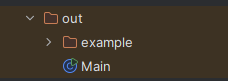
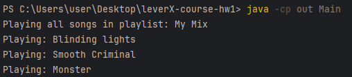
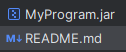
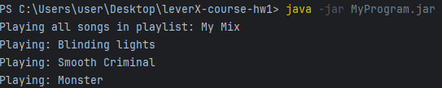

# Java Console Program – Greeter Example

## Description
This is a simple Java program that demonstrates the use of packages, classes and external libraries.  
The program defines a `Playlist` Class with a name and arrays of songs and uses lombok external library to generate Getters, Setters and Constructors without any boilerplate code.  
The `Main` class creates an instance of `Playlist` with its title and songs. Finally, it calls the playAll method.

## How to Compile and Run (from Console)

### 1. Compile the source code
Run the following command in the project’s root folder (where the `src` directory is located):

**Note:** Make sure you have `lombok.jar` in the project’s root folder. You can download it from [Project Lombok](https://projectlombok.org/download) (or if you cloned this repository, you should already have it in the root folder).
**Important:** Also, make sure to add Lombok to project classpath and enable annotation processing in your IDE if you are using one.

```bash
javac -cp lombok.jar -d out src/example/*.java src/Main.java
```

This will create an `out/` directory containing all compiled `.class` files.



### 2. Run the program
Run the following command to execute the program:
```bash
java -cp out Main
```
You should see the following output:



## Building an Executable JAR File

### 1. Create a JAR file (If you already have it, skip to the next step)

**Note:** if you cloned this repository, you should already have the JAR file in the projects root folder.

Run the following command to create an executable JAR file:
```bash
jar cfe MyProgram.jar Main -C out .
```
You should see a `MyProgram.jar` file in the project’s root folder.



### 2. Run the JAR file
Run the following command to execute the JAR file:
```bash
java -jar MyProgram.jar
```
You should see the same output as before:

