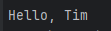

# Java Console Program – Greeter Example

## Description
This is a simple Java program that demonstrates the use of packages, interfaces, and classes.  
The program defines a `Greeter` interface and a `GreeterImpl` class that implements it.  
The `Main` class creates an instance of `GreeterImpl` and prints a greeting message to the console.

## How to Compile and Run (from Console)

### 1. Compile the source code
Run the following command in the project’s root folder (where the `src` directory is located):

```bash
javac -d out src/example/*.java src/Main.java
```
This will create an `out/` directory containing all compiled `.class` files.


### 2. Run the program
Run the following command to execute the program:
```bash
java -cp out Main
```
You should see the following output:



## Building an Executable JAR File

### 1. Create a JAR file (If you already have it, skip to the next step)
**Note:** if you cloned this repository, you should already have the JAR file in the projects root folder.

Run the following command to create an executable JAR file:
```bash
jar cfe MyProgram.jar Main -C out .
```
You should see a `MyProgram.jar` file in the project’s root folder.


### 2. Run the JAR file
Run the following command to execute the JAR file:
```bash
java -jar MyProgram.jar
```
You should see the same output as before:


